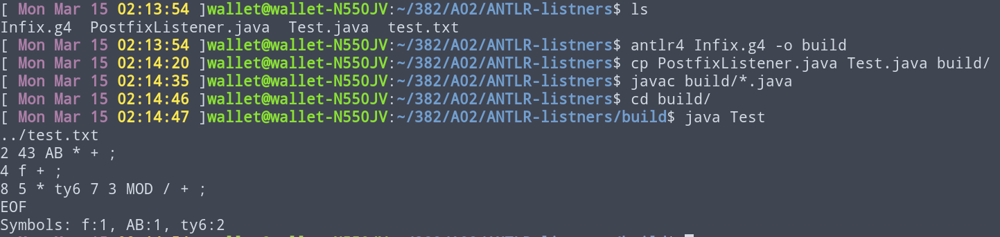

# A02

A simple project in my Language Structures class to play with Recursive Descent Parsers and ANTLR

## Usage & Demo

To test the ANTLR examples, `antlr4` should be [properly aliased](https://www.antlr.org)

### Recursive Descent Parser

### Antlr4 actions

### Antlr4 listeners + line numbers

